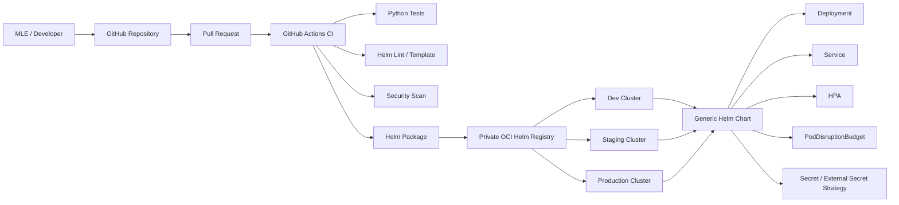

# MLOps Platform Engineering Take-Home Assignment

This repository implements a reusable deployment platform for ML APIs using:

- Python FastAPI
- Docker
- Kubernetes
- Helm
- Minikube
- GitHub Actions
- Terraform

The design uses **one generic Helm chart** and environment-specific values files for:

- Development
- Staging
- Production

The goal is to let Machine Learning Engineers deploy APIs with minimal configuration changes while keeping CI/CD, scaling, testing, security and infrastructure concerns reusable.

---

## 1. Architecture



For local validation:

```text
Laptop
  |
  v
Minikube
  |
  v
helm install ml-api ./helm/ml-api -f ./helm/ml-api/values-dev.yaml
  |
  v
Kubernetes Service
  |
  v
FastAPI ML API
```

---

## 2. Repository Layout

```text
.
├── app/
│   ├── main.py
│   ├── requirements.txt
│   ├── Dockerfile
│   └── tests/
│       └── test_api.py
├── helm/
│   └── ml-api/
│       ├── Chart.yaml
│       ├── values.yaml
│       ├── values-dev.yaml
│       ├── values-staging.yaml
│       ├── values-prod.yaml
│       └── templates/
│           ├── _helpers.tpl
│           ├── deployment.yaml
│           ├── service.yaml
│           ├── ingress.yaml
│           ├── hpa.yaml
│           ├── configmap.yaml
│           ├── secret.yaml
│           ├── serviceaccount.yaml
│           ├── pdb.yaml
│           ├── NOTES.txt
│           └── tests/
│               └── test-connection.yaml
├── terraform/
│   ├── main.tf
│   ├── variables.tf
│   ├── outputs.tf
│   └── versions.tf
├── scripts/
│   ├── local_validate.sh
│   └── minikube_deploy.sh
├── .github/
│   └── workflows/
│       ├── ci.yml
│       └── helm-release.yml
├── Makefile
└── .gitignore
```

---

## 3. Sample ML API

The sample application is intentionally simple because the assignment focuses on platform engineering rather than model development.

Endpoints:

- `GET /` -> Hello World style response
- `GET /health` -> liveness endpoint
- `GET /ready` -> readiness endpoint
- `POST /predict` -> sample prediction endpoint

Example:

```bash
curl http://localhost:8000/
curl http://localhost:8000/health
curl -X POST http://localhost:8000/predict \
  -H "Content-Type: application/json" \
  -d '{"features":[1.0,2.0,3.0]}'
```

---

## 4. Build the Application

```bash
docker build -t ml-api:local ./app
```

Run locally:

```bash
docker run --rm -p 8000:8000 ml-api:local
```

---

## 5. Run Application Tests

```bash
cd app
python -m pip install -r requirements.txt
pytest -q
```

---

## 6. Helm Chart

The Helm chart is generic. The same templates are reused across all environments.

Default values:

```bash
helm show values ./helm/ml-api
```

Lint:

```bash
helm lint ./helm/ml-api
```

Render templates:

```bash
helm template ml-api ./helm/ml-api \
  -f ./helm/ml-api/values-dev.yaml
```

---

## 7. Environment Strategy

The environment-specific values files contain only the settings that need to vary.

### Development

```text
values-dev.yaml
```

Typical characteristics:

- 1 replica
- low resource requests
- autoscaling disabled
- NodePort for easy local access

### Staging

```text
values-staging.yaml
```

Typical characteristics:

- 2 replicas
- autoscaling enabled
- stricter resource settings

### Production

```text
values-prod.yaml
```

Typical characteristics:

- 3 minimum replicas
- autoscaling enabled
- PodDisruptionBudget enabled
- hardened security context
- ingress enabled when desired

---

## 8. Deploy on Minikube

Start Minikube:

```bash
minikube start
```

Build the image directly into Minikube:

```bash
eval $(minikube docker-env)
docker build -t ml-api:local ./app
```

Deploy:

```bash
helm upgrade --install ml-api ./helm/ml-api \
  -f ./helm/ml-api/values-dev.yaml \
  --namespace ml-api-dev \
  --create-namespace
```

Check:

```bash
kubectl get pods -n ml-api-dev
kubectl get svc -n ml-api-dev
```

Access locally:

```bash
minikube service ml-api -n ml-api-dev --url
```

Or port-forward:

```bash
kubectl port-forward svc/ml-api 8000:80 -n ml-api-dev
```

Then:

```bash
curl http://localhost:8000/health
```

---

## 9. Helm Test

The chart contains a Helm test pod.

Run:

```bash
helm test ml-api -n ml-api-dev
```

The test validates that the service responds on `/health`.

---

## 10. CI/CD

### CI workflow

`.github/workflows/ci.yml`

On pull requests and pushes, it:

1. checks out code
2. installs Python dependencies
3. runs API tests
4. runs Helm lint
5. renders the chart for Dev/Staging/Prod
6. builds the Docker image
7. runs a Trivy scan when available

### Helm chart release workflow

`.github/workflows/helm-release.yml`

On a version tag such as:

```bash
git tag v0.1.0
git push origin v0.1.0
```

the workflow:

1. validates the chart
2. packages the chart
3. authenticates to a private OCI registry
4. pushes the Helm chart

The workflow is written for Amazon ECR using GitHub OIDC authentication. In a real organization the AWS role should be restricted to the repository and environment.

Required GitHub repository variables/secrets:

```text
AWS_REGION
AWS_ROLE_TO_ASSUME
ECR_HELM_REPOSITORY
```

No long-lived AWS access keys are required.

---

## 11. Version Control Strategy

Recommended model:

- protected `main` branch
- short-lived feature branches
- pull requests required
- CI checks required before merge
- semantic versioning for chart releases
- immutable container image tags
- production deployments tied to reviewed release tags

Example:

```text
feature/add-endpoint
        |
        v
Pull Request
        |
        v
CI validation
        |
        v
Review + Approval
        |
        v
main
        |
        v
v1.2.0 tag
        |
        v
Helm package + publish
```

---

## 12. Secret Management

Real secrets should **not** be committed to the Git repository.

The chart contains an optional Kubernetes Secret template for demonstration only.

For production, preferred design:

```text
AWS Secrets Manager
        |
        v
External Secrets Operator
        |
        v
Kubernetes Secret
        |
        v
ML API Pod
```

Other acceptable approaches:

- HashiCorp Vault
- Sealed Secrets
- cloud provider secret stores
- CSI Secrets Store Driver

The application should consume the resulting Kubernetes Secret through environment variables or mounted files.

Never store raw passwords, tokens or keys in:

- `values.yaml`
- source code
- GitHub Actions YAML
- Terraform code
- Git history

---

## 13. Autoscaling

The chart contains a Kubernetes HorizontalPodAutoscaler.

Example production configuration:

```yaml
autoscaling:
  enabled: true
  minReplicas: 3
  maxReplicas: 10
  targetCPUUtilizationPercentage: 70
```

For real ML inference workloads I would also consider:

- memory-based scaling
- custom Prometheus metrics
- request queue depth
- GPU utilization
- KEDA for event-driven inference

---

## 14. Reliability

The deployment includes:

- readiness probe
- liveness probe
- resource requests and limits
- rolling updates
- PodDisruptionBudget
- configurable replica count
- HPA
- graceful termination

This helps avoid routing requests to unhealthy pods and supports controlled production rollouts.

---

## 15. Security

The default chart demonstrates:

- non-root execution
- `allowPrivilegeEscalation: false`
- dropped Linux capabilities
- read-only root filesystem option
- ServiceAccount support
- optional secrets
- no hardcoded cloud credentials

For production I would additionally enable:

- image signature verification
- Kubernetes NetworkPolicies
- workload identity / IAM roles for service accounts
- admission policies
- SBOM generation
- container image scanning
- namespace isolation

---

## 16. Terraform / IaC

The Terraform example intentionally assumes an existing Kubernetes cluster to avoid provisioning chargeable infrastructure.

It deploys the chart using the Terraform Helm provider:

```bash
cd terraform
terraform init
terraform plan \
  -var="environment=dev"
terraform apply \
  -var="environment=dev"
```

The selected environment determines which Helm values file is used.

This keeps infrastructure automation consistent with the same generic Helm chart.

---

## 17. Make Targets

```bash
make test
make docker-build
make helm-lint
make helm-template
make minikube-deploy
make helm-test
```

---

## 18. Production Improvements

If this platform were expanded further, I would add:

- Argo CD / Flux for GitOps
- progressive delivery using Argo Rollouts
- canary releases
- OpenTelemetry
- Prometheus and Grafana
- SLOs and alerting
- centralized logging
- model metadata/version labels
- model drift monitoring
- inference latency and error-rate dashboards
- policy-as-code
- vulnerability gating
- provenance/SBOM attestation

---

## 19. Design Rationale

The key platform-engineering decision is to prevent each ML team from maintaining its own Kubernetes manifests.

Instead:

```text
ML Team
   |
   v
Small values file
   |
   v
Generic Helm Chart
   |
   v
Standardized Kubernetes Deployment
```

This provides:

- consistent deployments
- lower duplication
- faster onboarding
- centralized security controls
- reusable observability
- predictable CI/CD
- easier upgrades across environments
